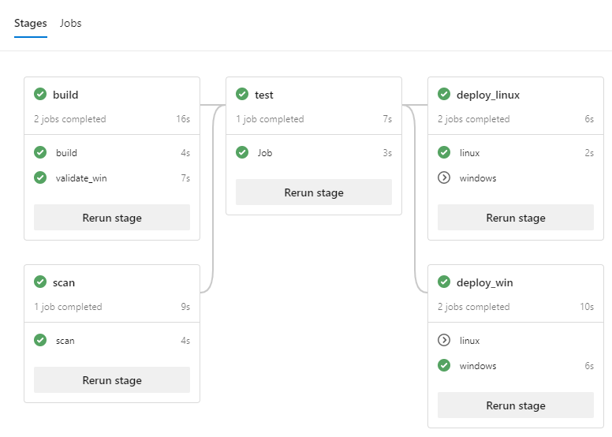

# Design & implement DevOps pipeline

This repo provides the guidance for designing and implementing Azure DevOps pipelines.

## Azure DevOps pipeline

See sample [mulit-stages pipeline](./devops/README.md)

## Self-host VMSS agent for Azure DevOps

- Create the VMSS agent pool
    - see, [Azure document for creating a VMSS agent pool](https://docs.microsoft.com/en-us/azure/devops/pipelines/agents/scale-set-agents)

- Add custom script to VMSS
    - see, [Azure document for adding custom script](https://docs.microsoft.com/en-us/azure/virtual-machines/extensions/features-linux#azure-portal)
    - [linux script for VM extension](./script/script.sh)

- Optional, automate creating a VMSS agent pool using IaC tool 
    - [Terraform sample](./terraform)

- Optional, automate creating a VM image
    - [Packer sample](./terraform)
